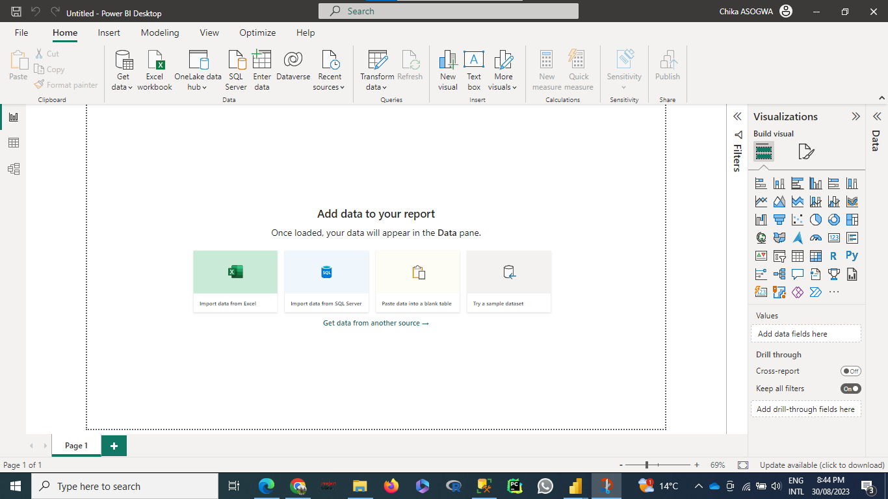
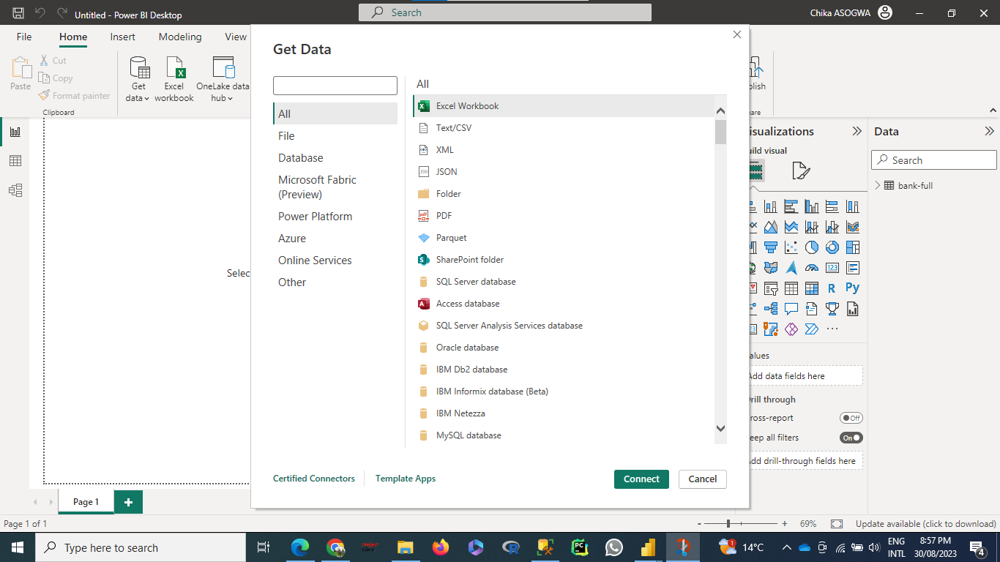
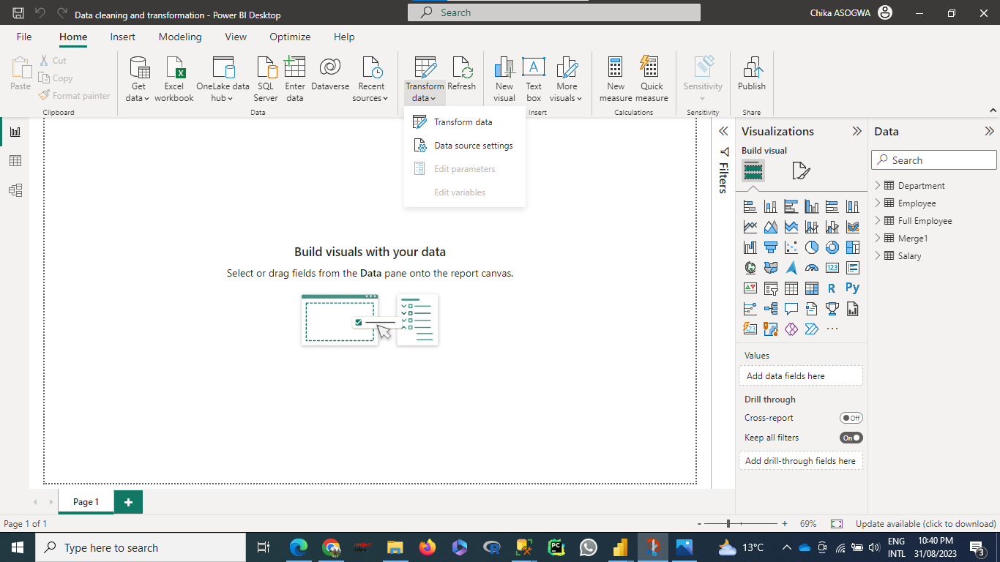
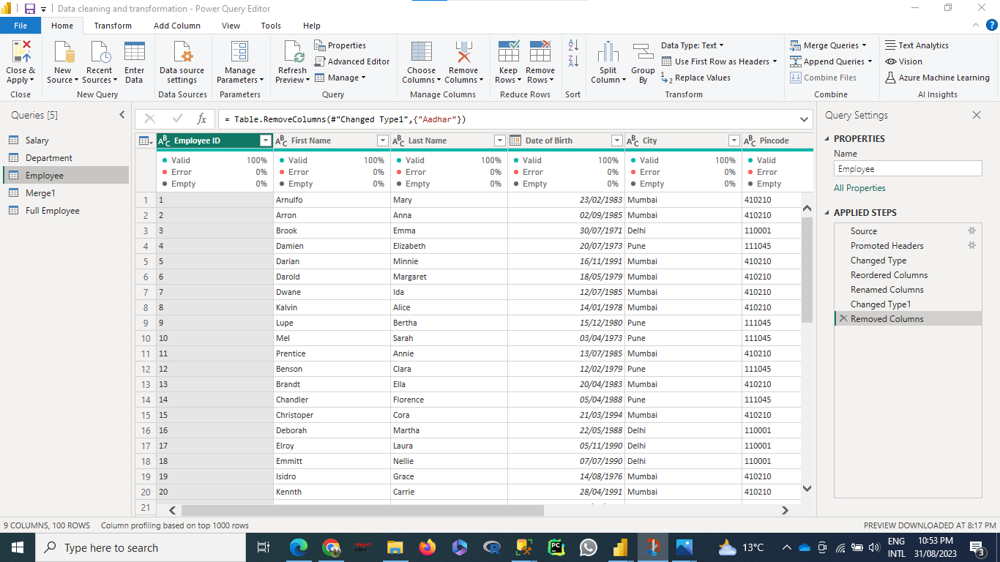
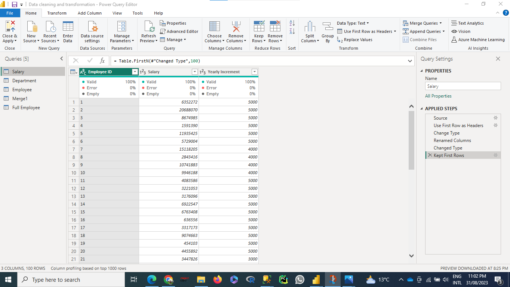
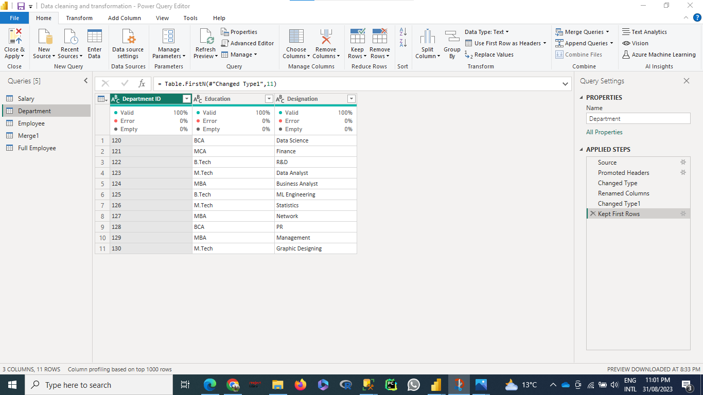

# Power BI Data Cleaning and Transformation Task Documentation

## Introduction

This documentation outlines the data cleaning and transformation tasks in Power BI Desktop for the Employee, Salary, and Department datasets. These tasks are essential to prepare the data for analysis and reporting. Below are the step-by-step instructions for performing these tasks.

### Step 1: Open Power BI Desktop

1. Launch Power BI Desktop.

### Step 2: Load CSV Files

1. Go to "Home" in the Power BI Desktop.

2. Click on "Get Data" and select "CSV."

3. Load the following CSV files: 
   - Employee.csv
   - Salary.csv
   - Department.csv

### Step 3: Transform Data

1. After loading the data, click on "Transform data under Queries" to open the Power Query Editor in a new window.

### Step 4: Cleaning Employee Table

1. Start by working on the Employee table.

2. Check column names and ensure they are meaningful:
   - Change `empID` to "Employee ID."
   - Change `name` to "Last Name."
   - Change `fname` to "First Name."
   - Change `deptID` to "Department ID."
   - Change `dob` to "Date of Birth."
   - Convert `aadhar`, `city`, `pincode`, `phone`, and `email` to proper case.

3. Examine data types for each column:
   - Change data types to "Text" for `Employee ID`, `Aadhar`, `Pincode`, `Phone`, and `Department ID`.

4. Remove the `Aadhar` column as it is not useful for analysis.

### Step 5: Cleaning Salary Table

1. Move on to the Salary table.

2. Check column names and ensure they are meaningful:
    - Change `empID` to "Employee ID."
    - Change `Base` to "Salary."
    - Change `yearly increament` to "Yearly Increment."

3. Analyze data quality indicators:
    - Note that 50% of the data is empty, and there are a total of 199 rows.

4. Use "Keep Top Rows" to retain the top 100 rows containing data.

5. Change the data type of `Employee ID` to "Text".

### Step 6: Cleaning Department Table

1. Proceed to the Department table.

2. Check column names and ensure they are meaningful:
    - Change `deptID` to "Department ID."
    - Write `education` in proper case.

3. Analyze data quality indicators:
    - Note that 94% of the data is empty, and there are a total of 199 rows.

4. Use "Keep Top Rows" to retain the top 11 rows containing data.

### Step 7: Merging Employee and Salary Tables

1. To merge the Employee and Salary tables, use the "Merge Queries" function in Power Query Editor.

2. Merge on `Employee ID` as the common column using an outer join.

3. After merging, open the new `Salary` column added, and expand it. Select the columns you want to merge and uncheck "Use original table name as prefix."

### Step 8: Merging Resultant Table with Department Table

1. To merge the resultant table with the Department table, use the "Merge Queries" function again.

2. Merge on `Department ID` as the common column using an outer join.

3. The merged table is now ready for further analysis and reporting.

### Conclusion

1. Close the Power Query Editor and load the cleaned and transformed data into Power BI Desktop.

2. You can now create visualizations, perform analysis, and build reports based on the cleaned data.

This completes the data cleaning and transformation process in Power BI Desktop for the Employee, Salary, and Department datasets. Ensure that you save your work and update the data as needed for ongoing analysis and reporting tasks.
